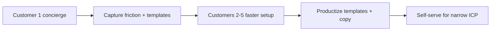

# S0 — Idea Intake: Concierge onboarding, temporary operator access, and customer handoff

| Field        | Value                                                                                                                                                                              |
| ------------ | ---------------------------------------------------------------------------------------------------------------------------------------------------------------------------------- |
| **Stage**    | S0 — Idea capture (not triage; no build commitment)                                                                                                                                |
| **Captured** | 2026-07-02                                                                                                                                                                         |
| **Product**  | Tally Runner (dashboard — org signup, admin users, setup, worker payments, invoicing)                                                                                              |
| **Source**   | Product owner — launch first customers via done-for-you setup with a clean transition to self-serve                                                                                |
| **Related**  | [`S0-worker-payments-liability-tightening.md`](./S0-worker-payments-liability-tightening.md), [`docs/operator/worker-payments-handoff.md`](../operator/worker-payments-handoff.md) |

---

## 1. Idea (submitter language)

Rather than waiting for fully polished self-serve UX, Tally Runner should be offered to **early customers** as a **concierge / done-for-you setup**:

1. The **customer owns** their organization and login from day one.
2. The **operator** (product owner or implementer) configures locations, workers, forms, pricing, invoicing, and worker-payment export workflows on their behalf.
3. After setup, the customer runs day-to-day operations **without** ongoing operator login.
4. The operator is **removed** from the org at handoff so ownership and liability stay with the customer.

This S0 captures the **operating model**, **current product constraints**, and **work required** to run concierge onboarding safely and transition cleanly to self-serve later.

**Guiding principle:** _Customer owns the org; operator is a temporary guest — not a platform super admin._

---

## 2. Problem / opportunity (why this matters)

| Problem                          | Impact                                           | Evidence                                                                                                          |
| -------------------------------- | ------------------------------------------------ | ----------------------------------------------------------------------------------------------------------------- |
| **High setup complexity**        | Cold signups fail before value                   | Onboarding checklist spans workers, locations, mobile forms, pricing, invoices, Stripe — no single guided path    |
| **Domain knowledge gap**         | SMB owners misconfigure pricing/splits           | Worker payments + dual pricing context (`customer` vs `worker`) is hard for non-technical users                   |
| **Product not self-serve ready** | Building perfect UX before first revenue is slow | Onboarding asks hourly/salary; some settings unenforced; liability copy still tightening (see worker-payments S0) |
| **Need paid learning**           | Building for imagined users wastes effort        | Concierge reveals real workflows, blockers, and templates worth productizing                                      |

**Opportunity:** Concierge onboarding for **3–10 customers** validates the core loop (jobs → invoice → worker export) while productizing repeated setup steps into templates and better UX.

---

## 3. Success (what “good” looks like — draft, non-binding)

_(Precise acceptance tests belong in S1/S2.)_

| Outcome                          | Measurement                                                                                                              |
| -------------------------------- | ------------------------------------------------------------------------------------------------------------------------ |
| **Customer ownership**           | Org registered under **customer email**; customer can log in without operator after handoff                              |
| **Operator access is temporary** | Setup admin user invited for implementation period; **removed or deactivated** at handoff                                |
| **No super-admin dependency**    | First pilots run without building platform-wide org switcher                                                             |
| **Documented handoff**           | Customer receives setup summary (locations, pricing approach, export steps)                                              |
| **Liability boundary**           | Engagement scope states operator configures from customer-provided rules; customer remains responsible for pay/legal/tax |
| **Repeatable playbook**          | Operator runbook exists; customer #2 needs less time than customer #1                                                    |
| **Transition path**              | Patterns from concierge inform templates, copy fixes, and later self-serve onboarding                                    |

---

## 4. Current product & codebase snapshot (verified)

### 4.1 Auth and roles today

| Layer                     | Location                                                                    | Behaviour                                                                   |
| ------------------------- | --------------------------------------------------------------------------- | --------------------------------------------------------------------------- |
| **Signup**                | `dashboard/app/signup/page.tsx` → `register-organization`                   | Creates org + primary admin auth user + `organization_user` row             |
| **Roles**                 | `organization_user.role`                                                    | `admin` or `viewer` only — **no platform super admin**                      |
| **Role resolution**       | `get-user-role`, `get-organization-id`                                      | Admin vs worker; org resolved from logged-in user                           |
| **Org lookup**            | `database/supabase/functions/_utils/auth.ts` → `getOrganizationIdFromAdmin` | Email → org via `.maybeSingle()` — **one email maps to one org**            |
| **Multi-admin**           | `create-organization-user`, `delete-organization-user`                      | Existing invite/remove flow; UI at `dashboard/app/dashboard/users/page.tsx` |
| **Dashboard org context** | `dashboard/hooks/useOrganization.ts`                                        | Single org per session — **no org switcher**                                |

### 4.2 Implications for concierge

| Constraint              | Consequence                                                                                                      |
| ----------------------- | ---------------------------------------------------------------------------------------------------------------- |
| **No super admin**      | Operator cannot access all customer orgs from one login without new product work                                 |
| **One email = one org** | Operator cannot reuse the same email across multiple customer orgs today                                         |
| **Org-scoped RLS**      | All dashboard actions require membership in that org’s `organization_user` table                                 |
| **Service role exists** | E2E helpers (`e2e/helpers/test-auth.ts`) can bootstrap users — **dev/test only**, not production concierge model |

### 4.3 What already supports concierge (no build)

| Capability                   | Notes                                                                                  |
| ---------------------------- | -------------------------------------------------------------------------------------- |
| Customer self-signup         | `/signup` + email verification                                                         |
| Invite second admin          | Settings → Users (`OrganizationUsersService`)                                          |
| Remove operator at handoff   | `delete-organization-user` (must not delete last admin)                                |
| Onboarding checklist         | `dashboard/components/onboarding/onboarding-checklist.tsx` — reference for setup scope |
| Operator worker-payments doc | `docs/operator/worker-payments-handoff.md`                                             |

---

## 5. Recommended operating model (v1 — no super admin)

### 5.1 Ownership rule

**The customer’s email is always the primary org owner.** Do not create production orgs under the operator’s personal email as primary admin.

### 5.2 Access patterns (pick per customer)

| Pattern                                                   | When to use                      | Handoff                                                              |
| --------------------------------------------------------- | -------------------------------- | -------------------------------------------------------------------- |
| **A. Screen-share setup**                                 | First customer; discovery-heavy  | Customer already sole admin; no operator user to remove              |
| **B. Temporary second admin**                             | Async configuration needed       | Invite `setup+{customerSlug}@operator-domain.com`; delete at handoff |
| **C. Customer signup + operator configures after verify** | Customer ready to own auth early | Same as B after verification                                         |

**Do not use as default:** shared long-term password, operator as permanent admin, or service-role/SQL setup in production.

### 5.3 Concierge setup scope (in scope)

| Area             | Operator action                                                                  |
| ---------------- | -------------------------------------------------------------------------------- |
| Locations        | Create hierarchy / sites                                                         |
| Workers          | Invite or create worker records                                                  |
| Mobile forms     | Field configs, sections, templates from customer brief                           |
| Customer pricing | Rules under `pricing_context = 'customer'`                                       |
| Worker pricing   | Rules under `pricing_context = 'worker'` — from **customer-provided** rates only |
| Invoice template | Logo, ABN, GST flags per customer instruction                                    |
| Test workflow    | One job → invoice preview → worker calculate → CSV export                        |
| Training         | Walk through worker payments boundary (calculate + export, pay elsewhere)        |

### 5.4 Concierge scope (out of scope — align with worker-payments S0)

| Out of scope                                                         | Reason                                 |
| -------------------------------------------------------------------- | -------------------------------------- |
| Deciding employee vs contractor                                      | Classification / sham contracting risk |
| Guaranteeing award or minimum wage compliance                        | Legal advice                           |
| Running payroll, PAYG, STP, super                                    | Statutory payroll                      |
| Marking workers paid on customer’s behalf without their confirmation | Misread as operator disbursed funds    |
| Ongoing operator login after handoff                                 | Ownership and liability blur           |

**Engagement line (draft):** _“Operator configures Tally from information provided by the customer. The customer remains responsible for paying workers and meeting legal, tax, and record-keeping obligations.”_

### 5.5 Handoff checklist (operator process)

1. Customer completes signup and email verification (if not already).
2. Operator completes setup; documents config summary (PDF/Notion/email).
3. **Handoff session (30–60 min):** customer runs job → invoice → worker export live.
4. Operator removed from **Users** (or set inactive if product supports it).
5. Customer confirms they can log in, invite workers, and export CSV without operator.
6. Support window defined (e.g. 2–4 weeks email support — no standing dashboard access).

---

## 6. Work required

### 6.1 Operational (no code — do first)

| ID  | Work                                                                                                                                 | Owner    | Priority |
| --- | ------------------------------------------------------------------------------------------------------------------------------------ | -------- | -------- |
| O1  | **Concierge runbook** — signup → setup → handoff → support (`docs/operator/concierge-onboarding.md`)                                 | Operator | P1       |
| O2  | **Setup intake form** — business name, locations, worker count, pricing rules, pay frequency, export destination (bank/payroll tool) | Operator | P1       |
| O3  | **Engagement / scope template** — in-scope vs out-of-scope; liability boundary; customer sign-off on rates provided                  | Operator | P1       |
| O4  | **Per-customer setup alias convention** — e.g. `setup+{slug}@yourdomain.com` (one alias per org until multi-org email supported)     | Operator | P1       |
| O5  | **Handoff summary template** — what was configured, where pricing lives, how to export worker payments                               | Operator | P1       |
| O6  | **Pricing intake worksheet** — customer-facing doc to collect rates before operator enters them                                      | Operator | P2       |

### 6.2 Product — near term (supports concierge without super admin)

| ID  | Work                                                                                                | Files / area                                                                                     | Priority |
| --- | --------------------------------------------------------------------------------------------------- | ------------------------------------------------------------------------------------------------ | -------- |
| P1  | **Worker payments liability copy** (from related S0)                                                | See [`S0-worker-payments-liability-tightening.md`](./S0-worker-payments-liability-tightening.md) | P1       |
| P2  | **Onboarding reframe** — stop implying hourly/salary in-app calculation                             | `onboarding-wizard.tsx`                                                                          | P1       |
| P3  | **Setup checklist link in dashboard** — operator can tick same steps as customer sees               | `onboarding-checklist.tsx`                                                                       | P2       |
| P4  | **Industry starter template (one vertical)** — pre-built field configs + pricing skeleton           | TBD — likely seed or “apply template” action                                                     | P2       |
| P5  | **Handoff confirmation UI (light)** — banner or checklist item: “Remove setup admin before go-live” | Users page or onboarding                                                                         | P2       |
| P6  | **Hide or document unenforced settings**                                                            | `worker-pay-period-settings-card.tsx` (`auto_calculate`, `require_approval`)                     | P2       |

### 6.3 Product — later (when managing 10+ orgs or support-at-scale)

| ID  | Work                                                            | Why defer                                     |
| --- | --------------------------------------------------------------- | --------------------------------------------- |
| L1  | **Platform operator role** (cross-org, audited)                 | Not needed for first 3–5 customers            |
| L2  | **Org switcher** in dashboard                                   | Blocked until L1 + multi-org email resolution |
| L3  | **Support access with customer consent** (time-limited, logged) | Better than permanent second admin            |
| L4  | **Self-serve setup wizard** from concierge learnings            | Productize after patterns repeat              |
| L5  | **In-app “Setup complete” handoff screen** for customer         | Nice after runbook proven                     |

### 6.4 Explicitly not recommended for v1

| Item                                        | Reason                                                       |
| ------------------------------------------- | ------------------------------------------------------------ |
| **Global super admin** for concierge        | Large build; blurs ownership; not needed for pilots          |
| **Same operator email on multiple orgs**    | Breaks `getOrganizationIdFromAdmin` (`.maybeSingle()`) today |
| **Production setup via service role / SQL** | No audit trail in product; bypasses normal admin UX          |
| **Operator-owned customer orgs**            | Painful handoff; customer may not control auth               |

---

## 7. Transition to self-serve (how concierge informs product)

| Concierge learning            | Self-serve artifact                 |
| ----------------------------- | ----------------------------------- |
| Same field configs every time | Industry template                   |
| Customers stuck on pricing    | Guided pricing wizard               |
| Worker export confusion       | In-app handoff doc + liability copy |
| Setup takes 4 hours           | Target &lt; 45 min with template    |
| Operator always removes self  | Handoff checklist in product        |

**Target ICP for self-serve (draft):** owner-operator, 3–15 workers, piece-rate or per-job pay, exports to bank/payroll — **not** full payroll compliance in-app.

---

## 8. Change inventory summary

| Workstream                                | Type     | Priority | Blocks                    |
| ----------------------------------------- | -------- | -------- | ------------------------- |
| W1: Concierge runbook + intake forms      | Ops docs | P1       | None                      |
| W2: Engagement / liability scope template | Ops docs | P1       | None                      |
| W3: Worker payments liability copy        | Product  | P1       | None                      |
| W4: Onboarding reframe                    | Product  | P1       | None                      |
| W5: Handoff summary template              | Ops docs | P1       | W1                        |
| W6: Industry setup template               | Product  | P2       | 1–2 concierge customers   |
| W7: Platform operator + org switcher      | Product  | P3       | 10+ orgs or support scale |

---

## 9. Open questions for S1 (Triage)

| #   | Question                                                                                          |
| --- | ------------------------------------------------------------------------------------------------- |
| 1   | **First vertical** for templates (e.g. car detailing, cleaning, trades)?                          |
| 2   | **Pricing model** for concierge — setup fee + monthly, or bundled trial?                          |
| 3   | **Support window** length and whether operator retains read-only access                           |
| 4   | **When to build org switcher** — customer count or support ticket threshold?                      |
| 5   | Should **setup admin invite** be a documented button path on Users page, or runbook-only for now? |
| 6   | Legal review of **engagement scope template** before first paid customer?                         |
| 7   | Same release as **worker-payments liability S0**, or ops docs first?                              |

---

## 10. Out of scope for this S0

- DAP / implementation steps for platform operator role
- Billing, Stripe tiers, or entitlement for “concierge included”
- Changes to RLS or `get-organization-id` multi-org behaviour
- Legal advice — engagement template requires qualified review

---

## 11. Post–S0 gate (Process Excellence)

> _If someone reads this idea in 6 months with no other context, will they understand what was meant?_

- **Yes, if:** reader sees (1) **concierge = customer-owned org + temporary operator admin**, (2) **no super admin for v1**, (3) **one-email-one-org constraint**, (4) **handoff = remove operator**, (5) **work split** between ops docs and product follow-ups.
- **After S1:** link triage outcome and first vertical; create `docs/operator/concierge-onboarding.md` if GO.

---

## 12. Related documents

| Doc                                                                                          | Relationship                                                   |
| -------------------------------------------------------------------------------------------- | -------------------------------------------------------------- |
| [`S0-worker-payments-liability-tightening.md`](./S0-worker-payments-liability-tightening.md) | Liability boundaries for worker payment setup during concierge |
| [`docs/operator/worker-payments-handoff.md`](../operator/worker-payments-handoff.md)         | CSV export training for customers                              |
| [`S0-worker-payments-disbursement.md`](./S0-worker-payments-disbursement.md)                 | Non-custodial product boundary                                 |
| `dashboard/app/signup/page.tsx`                                                              | Customer org creation entry point                              |
| `dashboard/app/dashboard/users/page.tsx`                                                     | Invite/remove setup admin                                      |

---

_S0 — Concierge onboarding and handoff — Tally Runner — 2026-07-02_
