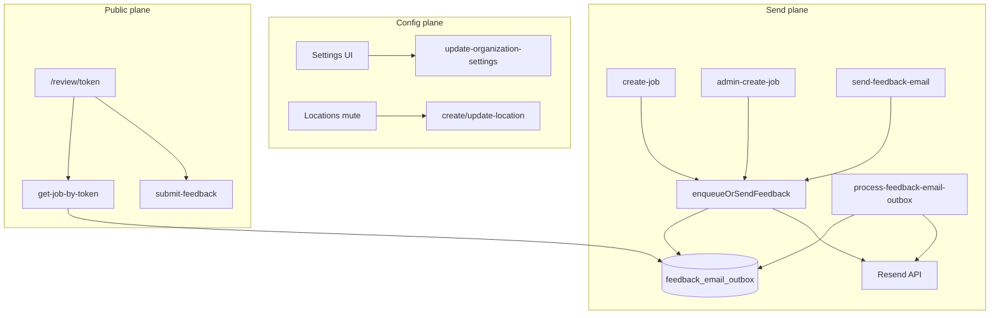
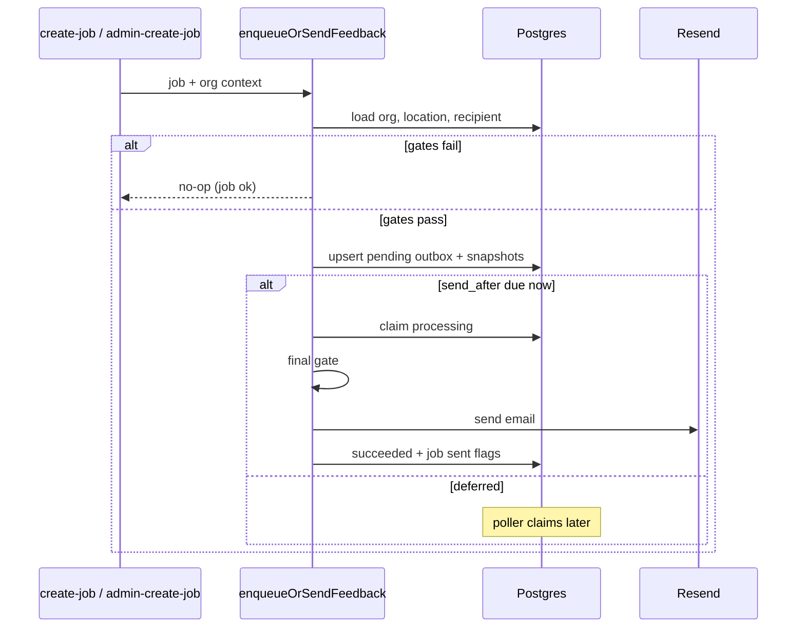
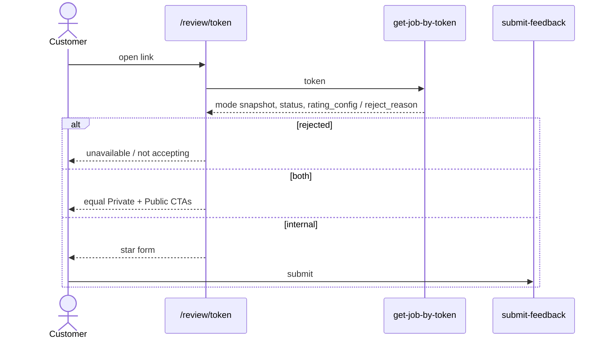

# S3 — High-Level Plan: Configurable customer feedback & review requests

| Field         | Value                                                                                                                         |
| ------------- | ----------------------------------------------------------------------------------------------------------------------------- |
| **Stage**     | S3 — High-Level Plan (strategy, phasing, architecture; **not** file-by-file steps)                                            |
| **From**      | S0, S1, [`S2-configurable-customer-feedback-reviews.md`](./S2-configurable-customer-feedback-reviews.md) (gold + adversarial) |
| **Execution** | [`S4`](./S4-configurable-customer-feedback-reviews.md) → **S5** build                                                         |
| **Created**   | 2026-07-21                                                                                                                    |
| **G3**        | **Accepted (proceed-to-S4)** — 2026-07-21                                                                                     |
| **Product**   | Tally Runner (Dashboard + Edge; **not** Mobile UI)                                                                            |

**Purpose:** S2 locks **what** to build. This document states **how** the pieces fit (DB, Edge, dashboard, cron), **phasing**, **architectural locks**, and **risks**. File-level steps and verify commands belong in **S4**.

**G2 status:** Stakeholder directed “proceed to S3” — treat S2 (including D1–D6 and §3.1 RBAC) as **accepted** unless overridden in writing.

---

## 1. Relationship to S2 and S4

| Stage  | Document  | Role                                                                         |
| ------ | --------- | ---------------------------------------------------------------------------- |
| **S2** | F&F       | Behaviour, state machines, ACs, adversarial contracts — **acceptance truth** |
| **S3** | This file | One mental model, workstreams, diagrams, architectural locks                 |
| **S4** | DAP       | Ordered tasks, paths, PRESERVE blocks, verify commands, rollback             |

If documents disagree: **S2** wins on product behaviour; **S4** wins on concrete paths/commands until updated.

---

## 2. System context

Today feedback mail is a **synchronous side-effect** of job create (`maybe-send-job-feedback-email` + duplicated logic in `admin-create-job`), gated only by `organization.feedback_email_send_immediately`. The public form is token-based with **no** approval-status checks.

v1 adds:

1. **Config plane** — org settings + per-location mute (admin-only writes).
2. **Data plane** — one shared **enqueue/claim/send** helper; durable **`feedback_email_outbox`**; cron poller with **shared secret**.
3. **Experience plane** — Settings / Locations / completed-job status / mode-aware `/review` landing.

**Out of v1 (unchanged from S2):** Mobile UI, per-location public URLs, HTML templates, frequency cap, unsend-after-flag, dual-read of legacy flag.

---

## 3. Architectural decisions (locked for v1)

| ID      | Decision              | Choice                                                                                                                                                                     | Rationale                                                    |
| ------- | --------------------- | -------------------------------------------------------------------------------------------------------------------------------------------------------------------------- | ------------------------------------------------------------ |
| **A1**  | Send entrypoint       | Single module e.g. `_utils/feedback-send.ts` (`enqueueOrSendFeedback`)                                                                                                     | S2 L16; kills admin-create drift                             |
| **A2**  | Due-now sends         | Always **outbox row + in-process claim** (no separate fire-and-forget path)                                                                                                | Avoids poller double-send race                               |
| **A3**  | Legacy flag           | **Single cutover** in one migration wave: add `feedback_auto_send` → backfill → switch callers → drop `feedback_email_send_immediately`                                    | Small caller set; dual-read adds risk                        |
| **A4**  | Config storage        | New columns on **`organization`** + mute on **`location`**                                                                                                                 | Matches `rating_config` / legacy flag placement              |
| **A5**  | Snapshots             | Columns on **outbox** at queue; mirror to **`job.feedback_mode_at_send` / `public_review_url_at_send`** on successful send                                                 | Landing prefers job snapshots                                |
| **A6**  | Test send             | **Dedicated** Edge function `send-feedback-test-email` (admin-only)                                                                                                        | Cleaner than overloading job send; synthetic fixture only    |
| **A7**  | Cron auth             | Env `CRON_SHARED_SECRET`; poller requires header `x-cron-secret: <secret>`                                                                                                 | S2 adversarial A8; do **not** copy open `auto-send-invoices` |
| **A8**  | Cron cadence          | **`*/5 * * * *`** via **active** `cron.schedule` migration                                                                                                                 | S2 lock; first real cron SQL in repo for this product area   |
| **A9**  | Job edit while queued | On `edit-job` (or equivalent) when pending outbox exists: **recompute `send_after`** from live job + org delay; if newly muted/cancelled/flagged → mark outbox `cancelled` | Prefer recompute over cancel+re-enqueue noise                |
| **A10** | Settings RBAC scope   | **Admin-only for feedback-related fields** (and test send). Broader “all settings admin-only” is **out of this milestone** (PRESERVE / separate hardening)                 | Minimises Article 1 blast radius                             |
| **A11** | Status exposure       | Extend **`list-jobs`** (and/or job detail payload used by completed-jobs) with a computed `feedback_request_status` object                                                 | Outbox is service-role RLS; no client reads                  |
| **A12** | Public URL in email   | Mode `public` → naked HTTPS URL; `both`/`internal` → `FEEDBACK_REVIEW_BASE_URL/review/{token}`                                                                             | S2 F4                                                        |
| **A13** | Template HTML         | Escape all substitutions; body = escaped plain text + ` `; separate `text/plain`                                                                                        | Fixes live XSS hole in `feedback-email.ts`                   |
| **A14** | Migration naming      | Timestamped files under `database/supabase/migrations/` — exact names in S4; order in §5 below                                                                             |                                                              |

---

## 4. Workstreams and phasing

Dependency order for S4. After **W1**, **W5/W6** can overlap with **W2–W4** if types are stubbed; **W7/W8** need helper + schema.

| WS     | Name                 | Scope                                                                                               | Depends on |
| ------ | -------------------- | --------------------------------------------------------------------------------------------------- | ---------- |
| **W1** | Schema               | Org columns, location mute, job snapshots, outbox + RLS + indexes, drop legacy flag, cron SQL stub  | —          |
| **W2** | Template + send core | Escaping renderer, CTA shapes, `enqueueOrSendFeedback`, unit tests                                  | W1         |
| **W3** | Create-path wire-up  | `create-job` + `admin-create-job` (delete inline), remove no-recipient token mint                   | W2         |
| **W4** | Poller + cron        | `process-feedback-email-outbox`, config.toml, inventory, secret, schedule                           | W2         |
| **W5** | Settings API + UI    | get/update fields, HTTPS validation, admin gate on feedback fields, Settings card, F9 test function | W1         |
| **W6** | Locations            | create/update/list types + form toggle + badge                                                      | W1         |
| **W7** | Public review        | `get-job-by-token` / `submit-feedback` rejects + snapshots; `/review` dual CTA                      | W2, W1     |
| **W8** | Completed jobs       | Status chips + admin send/resend UX; list-jobs status                                               | W2, W4, W5 |
| **W9** | Docs / help          | Help FAQ, release note (edit-window behaviour), env checklist                                       | W5         |

**Suggested ship slices (optional):**

1. **Slice A (safe core):** W1–W4 + W3 — safer auto-send with outbox; behaviour change for multi-worker orgs.
2. **Slice B (config UX):** W5–W6 + F9.
3. **Slice C (customer + ops UX):** W7–W8 + W9.

Prefer **one PR / one staging promote** if capacity allows — fewer half-migrated states. S4 may still stage commits.

---

## 5. Migration order (logical)

Exact filenames in S4. Logical sequence:

1. Add org feedback columns (`feedback_auto_send` default false, etc.) + backfill from `feedback_email_send_immediately`.
2. Add `location.feedback_requests_enabled`.
3. Add job snapshot columns.
4. Create `feedback_email_outbox` + partial unique pending + RLS service-role.
5. Switch all app/edge callers to new columns; stop writing legacy.
6. Drop `feedback_email_send_immediately`.
7. Cron: `cron.schedule('process-feedback-email-outbox', '*/5 * * * *', …)` posting with `CRON_SHARED_SECRET` (document project URL placeholder like commented invoice example).

**Rollback stance:** Prefer forward-fix; S4 lists `DOWN` notes per migration. Do not CASCADE-delete `feedback` rows.

---

## 6. Sequence: auto-send after job create

---

## 7. Sequence: cron poller

```mermaid
sequenceDiagram
  participant Cron as pg_cron
  participant P as process-feedback-email-outbox
  participant DB as outbox + job
  participant R as Resend
  Cron->>P: POST + x-cron-secret
  P->>P: reject if secret mismatch
  P->>DB: select due pending/failed
  loop each row
    P->>DB: claim processing
    P->>DB: re-read job/org/location
    alt gate fail
      P->>DB: cancelled or failed
    else
      P->>R: send
      P->>DB: succeeded + job snapshots/flags
    end
  end
```

---

## 8. Sequence: customer opens review link

---

## 9. Edge / dashboard inventory (anchor for S4)

| Area      | Primary touchpoints                                                                                                        |
| --------- | -------------------------------------------------------------------------------------------------------------------------- |
| Helper    | New `_utils/feedback-send.ts` (+ tests); slim/replace `maybe-send-job-feedback-email.ts`; rewrite `feedback-email.ts` HTML |
| Create    | `create-job/handlers/run-create-job-persistence.ts`; `admin-create-job/index.ts` (delete inline block)                     |
| Manual    | `send-feedback-email/index.ts` (admin + `auth_user_id` fix)                                                                |
| Test      | New `send-feedback-test-email`                                                                                             |
| Poller    | New `process-feedback-email-outbox` + `config.toml` + `functions-inventory.yaml`                                           |
| Settings  | `get-organization-settings`, `update-organization-settings`, settings page, edge-contracts, hooks, ratings-settings tests  |
| Locations | `create-location`, `update-location`, location form/list/types                                                             |
| Jobs UI   | `list-jobs` (status), `job-detail-dialog.tsx`                                                                              |
| Public    | `get-job-by-token`, `submit-feedback`, `dashboard/app/review/[token]/page.tsx`                                             |
| Edit      | Job edit path that updates `completed_at` / `location_id` / `approval_status` → outbox recompute (A9)                      |
| Ops       | Help page FAQ; env: `FEEDBACK_REVIEW_BASE_URL`, `CRON_SHARED_SECRET`                                                       |

---

## 10. Concurrency & failure modes

| Scenario                       | Design response                                                     |
| ------------------------------ | ------------------------------------------------------------------- |
| Dual create paths              | Same helper; pending unique + claim                                 |
| Flag after queue, before send  | Poller → `cancelled`                                                |
| Flag during `processing`       | Final gate before Resend → `cancelled`; if already sent → no unsend |
| Kill switch mid-flight         | Cancel pending; abort processing before Resend                      |
| Withdraw                       | Job DELETE → outbox CASCADE; link → missing job                     |
| Feedback row exists + withdraw | DB FK may block delete — clear error; do not CASCADE CSAT           |
| Mode/URL change after send     | Emails immutable; landing uses job snapshots                        |
| Resend                         | New attempt (`is_resend`); prior `succeeded` kept                   |
| Cron without secret            | 401/403; no work                                                    |
| Resend API failure             | attempts + backoff; job create unaffected                           |

---

## 11. Risks (HLP view)

| Risk                                                                | Impact         | Mitigation                                      |
| ------------------------------------------------------------------- | -------------- | ----------------------------------------------- |
| Behaviour change for existing auto-send orgs (wait for edit window) | Support noise  | Release note + Settings help (D2)               |
| Cron secret missing in an env                                       | Queue stalls   | Deploy checklist; failed job chip visible       |
| Partial cutover of legacy flag                                      | Dual behaviour | Single-PR caller inventory (S2)                 |
| XSS in email HTML                                                   | Security       | A13 + regression test                           |
| Broader settings RBAC creep                                         | Scope blow-up  | A10 — feedback fields only                      |
| Open batch functions elsewhere                                      | Platform debt  | Out of milestone; do not worsen feedback poller |

---

## 12. Rollout (high level)

1. **Staging:** migrate → deploy Edge + dashboard → set `CRON_SHARED_SECRET` + confirm schedule → dogfood modes.
2. **Verify:** withdraw-before-send, soft-cancel reject, kill switch cancels queue, admin-only send, HTML escape, test email.
3. **Production:** same order; announce edit-window timing change to orgs with auto-send on.
4. **Monitor:** outbox `failed` counts; Resend errors; cron 401s.

---

## 13. Deep review (S3 self-check)

| Check                                | Result                                                   |
| ------------------------------------ | -------------------------------------------------------- |
| Cross-ref S2 L1–L19, D1–D6, ACs 1–31 | Covered in A1–A14 + workstreams                          |
| “What breaks if we skip outbox?”     | Edit-window + delay impossible safely — **must ship W4** |
| “What breaks if we skip snapshots?”  | Mode flips rewrite customer offer — **must ship A5**     |
| Hostile gap: edit-job                | Locked A9                                                |
| Hostile gap: cron auth               | Locked A7                                                |
| Hostile gap: admin create drift      | Locked A1 + W3                                           |
| Buried opportunity                   | Reuse helper later for digest/reminder v2 — not in scope |

---

## 14. Handoff

| Next             | Artifact                                                                                         |
| ---------------- | ------------------------------------------------------------------------------------------------ |
| **S4 DAP**       | [`S4-configurable-customer-feedback-reviews.md`](./S4-configurable-customer-feedback-reviews.md) |
| **S5 Build**     | After G4 on S4 / explicit build go-ahead                                                         |
| **S2 reference** | Acceptance + copy + state machines                                                               |

---

## 15. S3 completion gate

- [x] Workstreams map to S2 features F1–F9
- [x] Diagrams match S2 send/public planes
- [x] Cron secret + active schedule locked (not deferred)
- [x] RBAC scope narrowed to feedback fields for PRESERVE
- [x] Job-edit pending-outbox behaviour locked (recompute via `update-job`)
- [x] G3 / proceed-to-S4
- [x] S4 DAP written

---

_End of S3 — S4 ready; proceed to S5 after G4._
