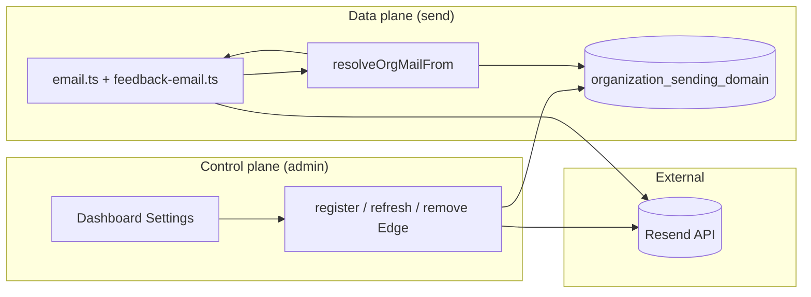
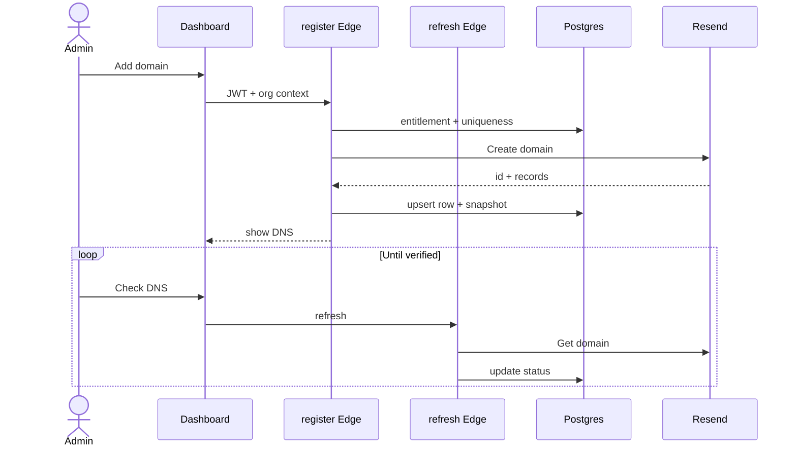
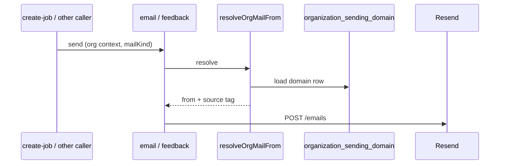

# S3 — High-Level Plan: Per-organization sending domain (Resend)

| Field         | Value                                                                                   |
| ------------- | --------------------------------------------------------------------------------------- |
| **Stage**     | S3 — High-Level Plan (strategy, phasing, architecture; **not** file-by-file steps)      |
| **From**      | S0, S1, [`S2-org-resend-email-domain.md`](./S2-org-resend-email-domain.md) (scope lock) |
| **Execution** | [`S4`](./S4-org-resend-email-domain.md) (DAP) → **S5** build                            |
| **Created**   | 2026-04-12                                                                              |
| **Product**   | Clean Log                                                                               |

**Purpose:** S2 locks **what** to build. This document states **how** the system fits together across DB, Edge, and dashboard; **phasing**; **concurrency and risk** calls; and **where** to execute next (S4). Implementation detail belongs in S4, not here.

---

## 1. Relationship to S2 and S4

| Stage  | Document  | Role                                                                                   |
| ------ | --------- | -------------------------------------------------------------------------------------- |
| **S2** | F&F scope | Matrix of mail kinds, precedence §4.4, NFRs, adversarial review — **acceptance truth** |
| **S3** | This file | **One** mental model, workstreams, diagrams, architectural locks                       |
| **S4** | DAP       | Ordered tasks, paths, verify commands, rollback SQL notes                              |

If S3 and S4 ever disagree, **S2** wins on product behavior; **S4** wins on file paths and commands until updated.

---

## 2. System context

Clean Log already sends transactional mail from Supabase **Edge Functions** using a **single platform** Resend API key. **Clients never** send email or choose `from` domains. This feature adds:

1. **Data:** per-org row describing the org’s Resend **domain** (metadata + snapshot of DNS), plus an **entitlement** flag.
2. **Control plane:** org-admin-only Edge functions to create / refresh / remove domains via Resend’s Domains API.
3. **Data plane:** a single **`resolveOrgMailFrom`** (or equivalent) used by all outbound `api.resend.com` paths so `from` follows S2 **§4** and **§4.4** precedence in **one** place.

**Out of v1 (unchanged from S2):** Supabase Auth / GoTrue `From` branding; BYO SMTP; per-tenant Resend API keys; multiple domains per org.

---

## 3. Architectural decisions (locked for v1)

| Decision                    | Choice                                                                                    | Rationale                                                                                                                   |
| --------------------------- | ----------------------------------------------------------------------------------------- | --------------------------------------------------------------------------------------------------------------------------- |
| **Keys**                    | One **platform** `RESEND_API_KEY` in Edge                                                 | Matches Resend “Option A” multi-tenant; no key distribution to orgs (S2 §14.1).                                             |
| **From resolution**         | **Central resolver** with explicit **`mailKind`** and S2 **§4.4** order                   | Prevents divergent `from` logic across 7+ HTTP call sites in `email.ts` + feedback.                                         |
| **Org domain read at send** | **Service-role** (or same pattern as other mailers) to read `organization_sending_domain` | Avoids RLS blocking the sending path; org id comes from **trusted** job / server context.                                   |
| **Entitlement (default)**   | **Option A — column** `custom_email_domain_enabled` on `organization`                     | Simplest to query in Edge; billing can move to Stripe metadata later (S2 §5.7). _Confirm in S4 if product picks B instead._ |
| **Fallback**                | If org domain missing, pending, disabled, or DB error → **platform** `RESEND_FROM_DOMAIN` | S2: never block sends solely because DNS is incomplete.                                                                     |
| **Cross-tenant domain**     | **Global `UNIQUE(domain_name)`** + Resend conflict handling                               | One DNS owner per hostname; S2 §4.2.                                                                                        |
| **Resend create region**    | Single env e.g. **`RESEND_SENDING_REGION`** on create-domain                              | S2 §5.2.                                                                                                                    |

**Explicit precedence (summary — full matrix in S2 §4.4):** org signup verification → always platform + **Clean Log**; admin invite → optional **`RESEND_ADMIN_INVITES_FROM_DOMAIN`** override; all other kinds → org domain if verified, else platform.

---

## 4. Workstreams and recommended phasing

Workstreams are **partially parallel** after the migration lands; the order below is the **dependency order** S4 also uses.

| Workstream          | Scope                                                                        | Depends on            |
| ------------------- | ---------------------------------------------------------------------------- | --------------------- |
| **W1 — Schema**     | `organization_sending_domain` + RLS + entitlement                            | Nothing               |
| **W2 — Resolver**   | `org-mail-from.ts`, `MailKind`, unit tests (§4.4)                            | W1                    |
| **W3 — Send path**  | `email.ts`, `feedback-email.ts`, `FeedbackEmailData.organizationId`, callers | W2                    |
| **W4 — Domain API** | register / refresh / remove Edge + rate limits + Resend error mapping        | W1, entitlement       |
| **W5 — Dashboard**  | Settings UI, `functions.invoke`, DNS copy, states per S2 §5.5                | W4 (refresh contract) |
| **W6 — Docs & ops** | Admin help, internal runbook, env docs                                       | W5 optional           |

**Optional tangential (from S2/S4):** remove dead `worker_payment_allocation` fetch in `calculate-worker-payment` **only** if present — same PR is acceptable if it stays mechanical; do not mix **split_weight** work here.

**Phase 1b (post-MVP):** S2 **§14.3** — `domain.verified` webhook, Resend **tags** on send, bounce/complaint webhooks with **`svix-id`** idempotency. S4 §10.

---

## 5. Sequence: org admin — add domain to verified

Path: entitlements on → add subdomain → show DNS from API snapshot → user configures DNS → **Check DNS** (refresh) until Resend reports verified. First transactional mail then uses org domain in `from` (per kind).

**Failure / abuse:** register and refresh are rate-limited; cross-org domain collision returns a **clear** error; orphan domain if Resend create succeeds and DB write fails is handled per S2 §6 and S4.

---

## 6. Sequence: outbound mail

Every Resend `emails` POST builds `from` only after resolver input: **`organizationId`**, **`mailKind`**, **`organizationName`** (where applicable). Feedback paths **must** set `organizationId` from **server-sourced** job data (S2 §4.1, §4.5).

---

## 7. Concurrency: two org admins

Only **one** active domain row per org (S2 **UNIQUE(organization_id)**). If two admins race on **register** with **different** names, **last successful write** wins for the single row: second transaction replaces or the second request fails on conflict — product choice is **last-write-wins** with clear UI error on conflict, **not** v1 distributed locking. **Refresh** and **remove** are idempotent and keyed to the current row. Document support macro: “if stuck, remove and re-add.”

---

## 8. Risks (condensed from S2 §6 / §13)

| Risk                                 | Mitigation in design                                                        |
| ------------------------------------ | --------------------------------------------------------------------------- |
| **Shared Resend team reputation**    | Entitlements, rate limits, §14.3 Phase 1b (tags, webhooks)                  |
| **Orphan Resend domain**             | Ordered create + DB; cleanup or playbook (S4)                               |
| **DB says verified, Resend deleted** | Stale state — refresh on error path / periodic / future webhook (S2 §6 NFR) |
| **Precedence bugs**                  | Unit tests lock §4.4 order                                                  |
| **Feedback spoofing**                | `send-feedback-email` re-loads job, compares org (S2 §4.5)                  |

---

## 9. Rollout (high level)

1. **Migrate** schema with entitlement default **off**.
2. **Deploy** resolver + refactored send paths (safe: fallback to platform for all orgs without verified domain).
3. **Deploy** domain lifecycle Edge + dashboard.
4. **Enable** entitlements per org / tier; internal dogfood → beta → GA (same narrative as S2 §8).

---

## 10. Handoff

| Next                         | Artifact                                                                                                           |
| ---------------------------- | ------------------------------------------------------------------------------------------------------------------ |
| **S4 (build / S5)**          | [`S4-org-resend-email-domain.md`](./S4-org-resend-email-domain.md) — file paths, tests, verify commands, rollback. |
| **Resend contract check**    | OpenAPI for create / get / delete domain before first staging integration.                                         |
| **Research (optional read)** | `docs/research/resend-official-alignment-2026.md`; S2 **§14** canonical for product alignment.                     |

---

## 11. S3 completion gate (before treating HLP as “approved”)

- [ ] Every workstream in §4 has a **clear owner** in the team sense (or single agent) and matches S4 sections.
- [ ] Diagrams in §2 / §5 / §6 are consistent with S2 **§4.4** and **§5**.
- [ ] Concurrency in §7 is acceptable to product; no need for stricter v1 than last-write.
- [ ] Phase 1b (§4 + S4 §10) is explicitly **out** of the MVP milestone unless product pulls it in.

---

_End of S3 — proceed to S4 for execution, then S5 build._
